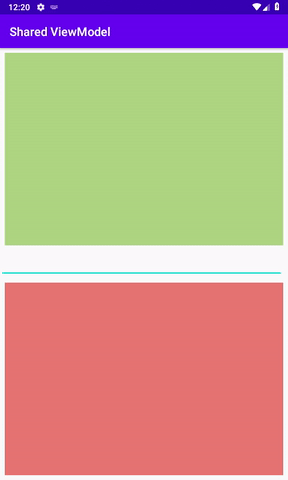

<h1 align="center">Android SharedViewModel Example</h1>
</br>
<h3 align="center">How to communicate between Activities or Fragments in Android</h3>
<p align="center">

</p>

* __dependencies__

```text
androidx.lifecycle:lifecycle-viewmodel-ktx
androidx.lifecycle:lifecycle-livedata-ktx
androidx.fragment:fragment-ktx
```
